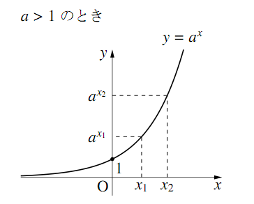
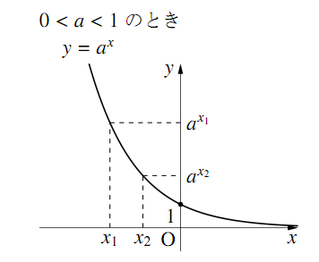
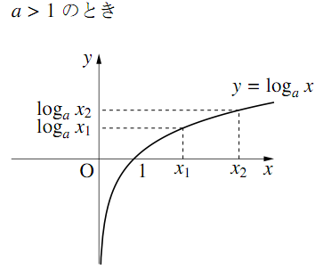
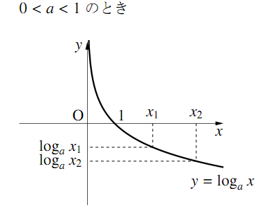

<!-- > pandoc 05-10-ans.md --mathjax -c ../css/mathjax.css --include-before-body=before-body.txt --include-after-body=after-body.txt -s -o 05-10-ans.html -->

# 1. 累乗根

$x^n=a$ となる $x$ を $a$ の $n$ 乗根といい，$\sqrt[n]{a}$ と表す．

### 問題： 次の値を根号を用いて表せ

A. $7$ の平方根

> 　  

B. $\pi$ の立方根

> 　  

C. $-16$ の $4$ 乗根

> 　  

# 2. 累乗根の性質

- $(\sqrt[n]{a})^n = a$
- $(\sqrt[n]{a})^m = \sqrt[n]{a^m}$
- $\sqrt[n]{a}\sqrt[n]{b}=\sqrt[n]{ab}$
- $\frac{\sqrt[n]{a}}{\sqrt[n]{b}}=\sqrt[n]{\frac{a}{b}}$

($a>0, b>0$ で $m,n$ が $2$ 以上の整数のとき）

### 問題： 次の式を簡単にせよ．

A. $\sqrt[4]{27}\sqrt[4]{3}$

> 　  
> 　  
> 　  

　  
　  

B. $\frac{\sqrt[3]{24}}{\sqrt[3]{3}}$

> 　  
> 　  
> 　  

C. $\frac{\sqrt[3]{147}\sqrt[3]{63}}{7}$

> 　  
> 　  
> 　  
> 　  
> 　  
> 　  
> 　  

# 3. 指数の拡張

- $a^0=1$
- $a^{-n}=\frac{1}{a^n}$ （ $n$ は正の整数）
- $a^{\frac{m}{n}}=\sqrt[n]{a^m}$ （ $a>0$，$m$ は整数，$n$ は $2$ 以上の整数）

# 4. 指数法則

- $a^p a^q = a^{p+q}$
- $\frac{a^p}{a^q}=a^{p-q}=\frac{1}{a^{q-p}}$
- $(a^p)^q=a^{pq}$
- $(ab)^p=a^p b^p$

($a>0, b>0$ で $p,q$ が 実数のとき）

　  

### 問題I： 次の計算をせよ．（ただし $x>0,y>0$）

　  
　  

A. $\{(x^{-2})^3\}^{-1}$

> 　  
> 　  
> 　  

B. $(x^2y)(xy^{-2})$

> 　  
> 　  

C. $\frac{x^{-3}}{(x^2)^{-1}}$

> 　  
> 　  
> 　  
> 　  
> 　  

D. $15^{\frac{1}{2}}\cdot 5^{-\frac{1}{2}} \cdot 3^{\frac{1}{2}}$

> 　  
> 　  
> 　  
> 　  

### 問題II： 次の各式を $\sqrt[n]{a^m}$ の形に表せ．（ただし $a>0$）

A. $a^{0.375}$

> 　  
> 　  
> 　  

B. $\frac{1}{a^{0.75}}$

> 　  
> 　  
> 　  

# 指数関数

$y=a^x$ （ただし $a>0, a\neq 1$ ）

### 問題

A. $y=(\frac{8}{5})^x$ のグラフをかけ

> 　  
> 　  
> 　  
> 　  
> 　  
> 　  
> 　  
> 　  
> 　  

B. $y=(\frac{5}{8})^x$ のグラフをかけ

> 　  
> 　  
> 　  
> 　  
> 　  
> 　  
> 　  
> 　  
> 　  

C. $y=2^x$ のグラフとの関係を考えて，$y=2\cdot 2^x$ のグラフをかけ

> 　  
> 　  
> 　  
> 　  
> 　  
> 　  
> 　  
> 　  
> 　  

D. 方程式 $3^{2x-1}-5\cdot 3^{x-1}=12$ を解け

> 　  
> 　  
> 　  
> 　  
> 　  
> 　  
> 　  
> 　  
> 　  
> 　  

# 対数

 $m=\log_a N \iff N=a^m$

# 対数の性質

基本性質

- $\log_a 1=0$，　$\log_a a=1$

- $\log_a MN = \log_a M + \log_a N$，　$\log_a \frac{M}{N}=\log_a M-\log_a N$

- $\log_a M^n=n\log_a M$

底の変換

- $\log_a b = \frac{\log_c b}{\log_c a}$

（$a>0,a\neq 1,　M,N>0$ のとき）

### 問題I： 次の値を求めよ

A. $\log_2 128$

> 　  
> 　  

B. $\log_2 0.25$

> 　  
> 　  
> 　  
> 　  

### 問題II： 次の式を計算せよ

A. $\log_3 6 + \log_3 \frac{3}{2}$

> 　  
> 　  
> 　  

B. $\log_7 (49^{-2})+\log_7 (\sqrt{7})$

> 　  
> 　  
> 　  
> 　  

# 対数関数

$m=\log_a x$ （ただし $a>0, a\neq 1$ ）

### 問題I： 次の関数のグラフをかけ

　  

A. $y=\log_5 x$

> 　  
> 　  
> 　  
> 　  
> 　  
> 　  
> 　  

B. $y=\log_{\frac{1}{2}} (-x)$

> 　  
> 　  
> 　  
> 　  
> 　  
> 　  
> 　  

### 問題II： 次の方程式を解け

A. $2\log_4 x=1$

> 　  
> 　  
> 　  
> 　  

B. $\log_{10} (x-48)+\log_{10} x=2$

> 　  
> 　  
> 　  
> 　  
> 　  

## 最後に

この資料と解答はwebで公開しています：  
**情報工学科のサイト（「大分高専 情報」で検索）→ スタッフ紹介（教職員紹介） → 西村俊二 → 一番下のリンク → 2S ALH**
