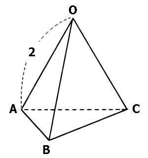

<!-- > pandoc lecture.md --mathjax -c ../../css/2s-alh.css --include-in-header=../in-header.txt --include-before-body=../before-body.txt --include-after-body=../after-body.txt -s -o lecture.html -->

**2S-ALH @2017/06/28 “線型代数 中間試験範囲の復習”**

# ベクトルの内積

**試験問題\[8\](2) 1辺の長さが $2$ の正四面体 $OABC$ について，$\vec{OA}\perp\vec{BC}$ を証明せよ．**

### 垂直を示すにはどうしたらよいか見当がつかない場合

- $\vec{OA}$ と $\vec{BC}$ の間の角 $\theta$ の話をしたい
- だが問題には正四面体（つまり全部 $60^\circ$ ）ということしか出てきていない
- 間の角 $\theta$ が必要なので，何か $\cos\theta$ が出てくる話を習ったことを思い出す
- たしか内積 $\vec{a}\cdot\vec{b}=|\vec{a}||\vec{b}|\cdot\cos\theta$ だった
- 角 $\theta$ を導くために内積 $\vec{OA}\cdot\vec{BC}$ を考える（下に続く）  

### 垂直→内積ゼロ がピンときた場合

$\vec{OA}\cdot\vec{BC}$  
$=\vec{OA}\cdot(\vec{OC}-\vec{OB})$  
$=\vec{OA}\cdot\vec{OC}-\vec{OA}\cdot\vec{OB}$  
$=|\vec{OA}||\vec{OC}|\cos 60^\circ - |\vec{OA}||\vec{OB}|\cos 60^\circ$  
$=2\cdot2\cdot\frac{1}{2}-2\cdot2\cdot\frac{1}{2}$  
$=0$  

（つまり，$|\vec{OA}||\vec{BC}|\cos\theta=0$）  
（よって，$\cos\theta=0$．∴ $\theta=90^\circ$）  
∴ $\vec{OA}\perp\vec{BC}$

# 平面の方程式

**試験問題\[10\] 3点 $A(1,1,-1), B(0,1,3), C(4,3,1)$ を通る平面の方程式を求めよ。**

$\vec{AB}=(-1,0,4)$，$\vec{AC}=(3,2,2)$

### 方法1： 法線ベクトルを使う（＝模範回答）

> 法線ベクトル $(a,b,c)$ で定まり $(x_0,y_0,z_0)$ を通る平面の方程式は，  
>  $a(x-x_0)+b(y-y_0)+c(z-z_0)=0$  

求める平面の法線ベクトルを $\vec{n}=(a,b,c)$ とすると，  
 $\vec{n}\perp\vec{AB}$ より，$-a+4c=0$ …(1)  
 $\vec{n}\perp\vec{AC}$ より，$3a+2b+2c=0$ …(2)  
(1)より $a=4c$，さらに(2)より $b=-7c$ ．  
よって，  
 $4c(x-1)-7c(y-1)+c(z+1)=0$  
$c$ で割って，  
 $4x-7y+z+4=0$
 
### 方法2： ベクトルの和で表す

求める平面は，  
$(x,y,z)$  
$=\vec{OA}+u\vec{AB}+v\vec{AC}$  
$=(1,1,1)+u(-1,0,4)+v(3,2,2)$  
よって，  
\begin{eqnarray} \left\{ \begin{array}{l}
  x=1-u+3v\\
  y=1  +2v\\
  z=-1+4u+2v
\end{array} \right. \end{eqnarray}
これから $u,v$ を除去すると，  
 $4x-7y+z+4=0$

# 直線の方程式

**試験問題\[11\] 次の2直線は交わるか．交わるときは，その交点の座標を求めよ．**  
　$x-1=\frac{y+1}{2}=\frac{z+5}{2}$ …(1)  
　$\frac{x-6}{2}=\frac{y+1}{-1}=\frac{z-1}{2}$ …(2)  

（模範回答では $s,t$ とおいていたが…）  
 $2x-2=y+1=z+5$ …(1')  
 $x-6=-2y-2=z-1$ …(2')  
(1')-(2')  
 $x+4=3y+3=6$  
これより $x=2$，$y=1$ ，  
最後に $z=-3$ も得られる．  
**これら $x,y,z$ は(1),(2)を満たす．**  
∴ $(2,1,-3)$ で交わる．

　  
　  
　  

---

この資料はwebで公開しています：  
  
**西村のオフィシャルサイト（「大分高専 西村」で検索）→ 一番下のリンク → 授業 → 2S ALH**
