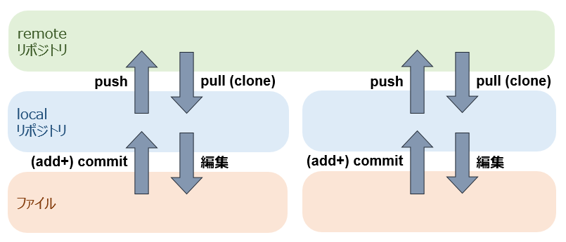

<!-- > pandoc afterthat.md --include-in-header=in-header.txt -c the.css -s -o afterthat.html -->

# チュートリアル後に再度使うとき

`> Set-Alias git F:\PortableGit\bin\git.exe` （gitと打てばこれが実行されるように）

　 

`> git config --global user.name "xxx"`

`> git config --global user.email "yyy@zzz.jp"` （最初に名前とメアドの設定が必須）

　 

`> $env:home = "F:"` （SSHのキーがここに置いてあるので）

　 

