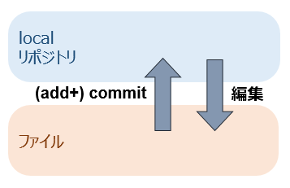
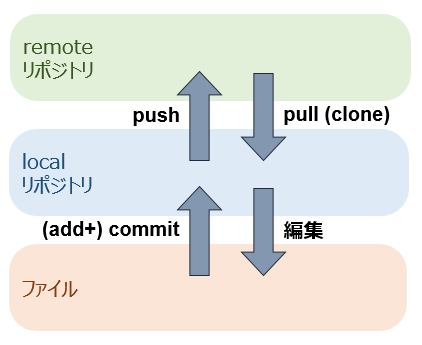

<!-- > pandoc tutorial.md --include-in-header=in-header.txt -c the.css -s -o tutorial.html -->

# なぜバージョン管理システムが必要？

[サルでもわかるGit入門](https://www.backlog.jp/git-guide/intro/intro1_1.html)

# Gitのインストール

実験室のPCはインストールが許可されていないので、Potable版をUSBメモリにインストールします。

[Downloading Git](https://github.com/git-for-windows/git/releases/download/v2.14.2.windows.1/PortableGit-2.14.2-64-bit.7z.exe)

インストール先を `F:\PortableGit` と指定する。

Windows PowerShellを開く（windows左下の検索から探すなど）

`> Set-Alias git F:\PortableGit\bin\git.exe` （gitと打てばこれが実行されるように）

`> git --version` → 表示を確認

`> git config --global user.name "xxx"`

`> git config --global user.email "yyy@zzz.jp"` （最初に名前とメアドの設定が必須）

# 一人で使う

## リポジトリ作成→コミット

`> mkdir xxx`

`> cd xxx` 

`> git init` （リポジトリ作成）

- yyy.txt を作成

`> git add yyy.txt` （ファイルをリポジトリに登録）

`> git commit yyy.txt --message "zzz"` （変更をcommit）

`> git log` （ログを見る）

## 再コミット

- yyy.txt を編集

`> git commit yyy.txt --message "ZZZ"`

`> git log`

## 以前のバージョンに戻す

`> git log`

`> git reset --hard xxxxxxxxxxxxxxxxxxxxxxxxxxxxxxxxxxxxxxxx` （ログを見てどれか指定する）

# オンラインで使う

## GitHubアカウント作成

[GitHub](https://github.com/)

**注意**：メールアドレスの確認があるので、すぐに受信できるメアドで登録すること

## SSHの準備

`> $env:home = "F:"` （今後の作業のために環境変数を一時的に変更）

`> F:/PortableGit/usr/bin/ssh-keygen.exe` （SSH用の鍵を作成。いろいろ聞いてくるが全てEnter）

F:/.ssh の下にできた公開鍵(id_rsa.pub)をGitHubに登録

- 右上のアイコン → Settings → 左の列からSSH and GPG keys → New SSH Key → Keyの中にペースト

## remoteリポジトリを作成

（進む前にメアドの認証をしておくこと）

GitHubの右上の＋(プラス) → New repository → リポジトリ名決めてcreate

`> git remote add origin git@github.com:xxx/yyy.git` （xxx：ユーザ名，yyy：リポジトリ名）

`> git push origin master`

（are you sure と聞かれたら yes）

GitHubをリロードしてみるとファイルが見えるはず。

# 複数人で使う

## ！！リーダのみ！！グループのorganizationリポジトリを作成

**グループのリーダのみが行ってください**

GitHubの右上の＋(プラス) → New organization

グループのメンバーを登録する（全員にowner権限を与える）

グループの共用リポジトリを作成

`> git remote add origin git@github.com:xxx/yyy.git` （xxx：organization名，yyy：共用リポジトリ名）

（remote origin already exists と言われたら `> git remote remove origin` してから）

`> git push origin master`

## 各メンバーは：

GitHubに登録したメアドにorganizationへの招待確認メールが届くので承認する

グループの共用リポジトリをcloneして今後の作業に備える

`> git clone git@github.com:xxx/yyy.git`

## 課題1：全員が自分の名前のファイルを追加する

cloneしたリポジトリについてのpushは `> git push` だけでOK。（元リポジトリが分かっているので）

## 課題2：他人が作成したファイルを書き換えてみる
